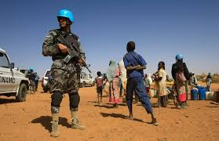
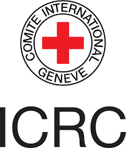
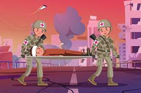
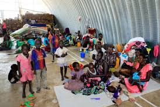

# ⚖️ HUKUM HUMANITER INTERNASIONAL: ATURAN SAAT KONFLIK BERSENJATA

---

## 🧭 Pendahuluan

Hukum Humaniter Internasional (HHI), atau *International Humanitarian Law (IHL)*, adalah cabang dari hukum internasional yang bertujuan untuk mengatur jalannya konflik bersenjata. Fokus utamanya adalah untuk **melindungi mereka yang tidak ikut serta dalam pertempuran**, serta **membatasi cara dan metode berperang**.

Tujuan utama HHI meliputi:

- Memberikan perlindungan terhadap korban konflik seperti warga sipil, tenaga medis, tawanan, dan mereka yang terluka.
- Membatasi penderitaan yang tidak perlu dengan mengatur jenis senjata dan taktik yang digunakan.

> **“Perang memang brutal, tapi HHI memastikan bahwa kemanusiaan tetap dipertahankan.”**  
> – International Committee of the Red Cross (ICRC)

---

## ⚔️ Aturan Dasar dalam Konflik Bersenjata

Hukum Humaniter Internasional menetapkan sejumlah aturan dasar bagi pihak-pihak yang terlibat dalam konflik bersenjata:

### 1. **Larangan terhadap Senjata Tertentu**

- Senjata kimia dan biologi sepenuhnya dilarang.
- Penggunaan ranjau darat dan senjata yang sulit dikendalikan dibatasi.
- Senjata yang menyebabkan luka yang tidak perlu atau penderitaan berlebihan tidak diperbolehkan.

### 2. **Pembatasan Metode dan Taktik Perang**

- Dilarang menggunakan taktik yang bersifat tidak manusiawi.
- Tidak boleh menyamar sebagai tenaga medis atau pekerja kemanusiaan.
- Serangan balasan yang tidak proporsional dengan serangan awal tidak dibenarkan.

---

## 🎯 Siapa Target Sah?

Prinsip utama dalam HHI adalah **Distinction (Pembedaan)**: yaitu membedakan antara kombatan (pejuang bersenjata) dan non-kombatan (warga sipil). 

| **Target Sah**                 | **Target Tidak Sah**                       |
|-------------------------------|--------------------------------------------|
| Tentara aktif (kombatan)      | Warga sipil yang tidak terlibat langsung   |
| Infrastruktur militer         | Sekolah, rumah ibadah, rumah sakit         |
| Kendaraan tempur dan gudang   | Bangunan sipil lainnya                     |

> Serangan terhadap warga sipil atau objek sipil merupakan pelanggaran berat terhadap hukum humaniter dan dapat dikategorikan sebagai **kejahatan perang**.

  
  
<em>Gambar: Perlindungan warga sipil sangat penting dalam konflik bersenjata.</em>

---

## 🛡️ Perlindungan Terhadap Warga Sipil

Warga sipil memiliki hak atas perlindungan khusus dalam situasi konflik. HHI menekankan bahwa:

- Warga sipil tidak boleh dijadikan sasaran serangan.
- Mereka berhak menerima bantuan kemanusiaan tanpa diskriminasi.
- Fasilitas sipil seperti rumah sakit dan sekolah harus dijaga dari serangan.
- Tenaga medis dan relawan kemanusiaan dilindungi oleh simbol-simbol khusus seperti **Palang Merah**.

  
  
<em>Simbol Palang Merah menandakan perlindungan medis yang harus dihormati.</em>

---

## ⚖️ Prinsip Proporsionalitas

Prinsip **Proporsionalitas** dalam HHI mencegah tindakan militer yang keuntungannya tidak sepadan dengan kerugian sipil yang ditimbulkan.

### Penjelasan:

- Serangan hanya boleh dilakukan jika keuntungan militer yang dihasilkan **jauh lebih besar** daripada risiko atau korban sipil.
- Tujuan utama adalah meminimalkan penderitaan dan melindungi kemanusiaan.

### Contoh Penerapan:

| **Jenis Serangan**                    | **Korban Sipil** | **Keuntungan Militer** | **Diperbolehkan?** |
|--------------------------------------|------------------|------------------------|---------------------|
| Serangan terhadap pangkalan militer  | Sedikit          | Besar                  | ✅ Ya                |
| Bom besar ke daerah padat penduduk   | Banyak           | Minimal                | ❌ Tidak             |

  
  
<em>Gambar: Prinsip HHI dituangkan dalam Konvensi Jenewa.</em>

---

## 📜 Dasar Hukum Humaniter Internasional

Berikut adalah dokumen-dokumen utama yang menjadi landasan HHI:

| **Dokumen / Konvensi**              | **Isi Pokok**                                                  |
|------------------------------------|----------------------------------------------------------------|
| **Konvensi Jenewa 1949**           | Perlindungan bagi korban perang dan warga sipil.              |
| **Protokol Tambahan I (1977)**     | Aturan untuk konflik bersenjata internasional.                |
| **Protokol Tambahan II (1977)**    | Aturan untuk konflik bersenjata non-internasional.            |
| **Statuta Roma (1998)**            | Pembentukan Mahkamah Pidana Internasional (ICC).              |

---

## 📊 Penerapan HHI di Dunia Nyata

### 1. **Konflik di Suriah**  
Serangan terhadap rumah sakit, sekolah, dan fasilitas sipil lainnya selama konflik di Suriah dianggap sebagai pelanggaran berat terhadap HHI.

### 2. **Perang Dunia II**  
Kejahatan kemanusiaan besar seperti Holocaust dan serangan terhadap warga sipil menjadi latar belakang lahirnya Konvensi Jenewa 1949.

### 3. **Konflik di Afghanistan**  
Pasukan internasional sering menghadapi dilema antara tujuan militer dan perlindungan sipil — sehingga penerapan prinsip proporsionalitas menjadi sangat penting.

  
  
<em>Gambar: Pengungsi perang yang membutuhkan perlindungan dan bantuan kemanusiaan.</em>

---

## 🧠 Kesimpulan

Hukum Humaniter Internasional hadir bukan untuk menghentikan perang, melainkan untuk **mengatur dan membatasi penderitaan yang disebabkan oleh perang**. Beberapa prinsip pentingnya adalah:

- **Pembedaan antara kombatan dan non-kombatan.**
- **Perlindungan warga sipil dan fasilitas penting.**
- **Proporsionalitas dalam serangan.**

Dengan adanya HHI, dunia diingatkan bahwa bahkan dalam konflik bersenjata, **kemanusiaan tetap harus dihormati**.

---

## 📚 Referensi dan Bacaan Lanjutan

- [International Committee of the Red Cross (ICRC)](https://www.icrc.org)
- [Konvensi Jenewa 1949 - ICRC](https://ihl-databases.icrc.org/ihl/INTRO/365)
- [Statuta Roma Mahkamah Pidana Internasional (ICC)](https://www.icc-cpi.int/resource-library/documents/rs-eng.pdf)
- [Geneva Academy – International Humanitarian Law](https://www.geneva-academy.ch/)
- [United Nations OCHA](https://www.unocha.org)
- [Human Rights Watch – Laws of War](https://www.hrw.org/topic/arms/laws-war)
- [Amnesty International – IHL](https://www.amnesty.org/en/what-we-do/armed-conflict/)
- [UNHCR – Hukum Perlindungan Pengungsi](https://www.unhcr.org)

---

**Disusun oleh:**  
**Sertu Pom Bana Ridho W.**  
**Sertu Mar Putra R.**  
**Kls Lpu Haris P.**  

<i>Agustus 2025</i>

