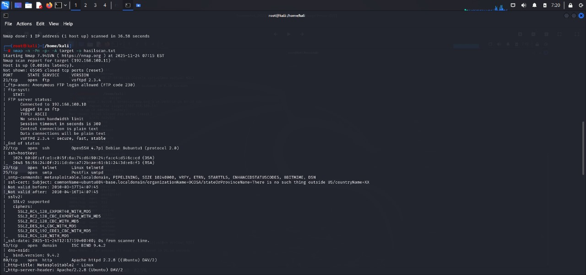
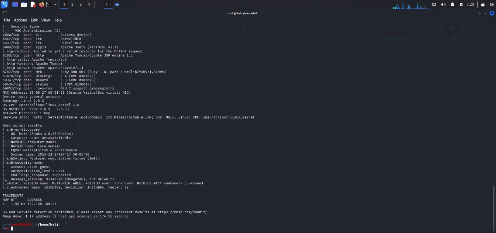

# 🚀 **Laporan Hasil Scan Nmap – Metasploitable2**
**Target Host:** `192.168.100.10`  

------------------------------------------------------------------------

## 🖥️ **Screenshot Hasil Scan**

### 📌 Screenshot 1


------------------------------------------------------------------------

### 📌 Screenshot 2


------------------------------------------------------------------------

### 📌 Screenshot 3


------------------------------------------------------------------------

# 🛠️ **Perintah Nmap yang Digunakan**

```bash
nmap -sV -sC -O 192.168.100.10

------------------------------------------------------------------------

# 📊 **Ringkasan Hasil Scan Port**

  Port       Status   Layanan      Deskripsi
  ---------- -------- ------------ --------------------------------------
  21         open     FTP          vsftpd 2.3.4 (anonymous login, backdoor)
  22         open     SSH          OpenSSH 4.7p1 (algoritma lama)
  23         open     Telnet       Tidak terenkripsi
  25         open     SMTP         Postfix, VRFY aktif
  53         open     DNS          BIND 9.4.2
  80         open     HTTP         Apache 2.2.8 + WebDAV
  111        open     RPCBind      Pemetaan RPC
  139/445    open     SMB          Samba 3.0.20 (signing off)
  512--514   open     RServices    rlogin, rexec, rsh (tidak aman)
  1099       open     Java RMI     Rentan RCE
  2049       open     NFS          Dapat di-mount tanpa autentikasi
  2121       open     ProFTPD      Versi lama, RCE
  3306       open     MySQL        root tanpa password
  3632       open     distccd      Rentan remote shell
  5432       open     PostgreSQL   Versi lama
  5900       open     VNC          Tidak terenkripsi
  6000       open     X11          Akses GUI + keylogging
  6667       open     UnrealIRCd   Backdoor bawaan
  7001       open     JServ        Rentan traversal
  8009       open     AJP13        Rentan file inclusion
  8180       open     Tomcat       Admin lemah

------------------------------------------------------------------------

🔍 Analisis Kerentanan per Port
🔸 Port 21 – FTP (vsftpd 2.3.4)

    Mendukung anonymous login

    Memiliki backdoor vulnerability

    Risiko: 🔥 High
------------------------------------------------------------------------

🔸 Port 22 – SSH

    Versi lama

    Algoritma kunci lemah

    Risiko: ⚠️ Medium
------------------------------------------------------------------------

🔸 Port 23 – Telnet

    Tidak ada enkripsi

    Password mudah disadap

    Risiko: 🔥 High
------------------------------------------------------------------------

🔸 Port 25 – SMTP (Postfix)

    VRFY aktif → dapat enumerate user

    Rentan mail relay

    Risiko: ⚠️ Medium
------------------------------------------------------------------------

🔸 Port 53 – DNS (Bind 9.4.2)

    Rentan cache poisoning

    Banyak CVE publik

    Risiko: ⚠️ Medium
------------------------------------------------------------------------

🔸 Port 80 – HTTP (Apache 2.2.8)

    Support WebDAV → upload shell

    Banyak eksploit RCE

    Risiko: 🔥 High
------------------------------------------------------------------------

🔸 Port 139/445 – SMB (Samba 3.0.20)

    SMB signing disabled

    Rentan RCE (CVE-2007, CVE-2017)

    Risiko: 🚨 Critical
------------------------------------------------------------------------

🔸 Port 512/513/514 – RServices

    Tidak terenkripsi

    Menggunakan autentikasi host-based

    Risiko: 🔥 High
------------------------------------------------------------------------

🔸 Port 1099 – Java RMI

    Rentan Remote Code Execution

    Risiko: 🔥 High
------------------------------------------------------------------------

🔸 Port 2049 – NFS

    Dapat di-mount tanpa autentikasi

    Pengambilalihan file sistem

    Risiko: 🔥 High
------------------------------------------------------------------------

🔸 Port 2121 – ProFTPD 1.3.1

    Banyak bug RCE

    Risiko: 🔥 High
------------------------------------------------------------------------

🔸 Port 3306 – MySQL

    root tanpa password

    Risiko: 🚨 Critical
------------------------------------------------------------------------

🔸 Port 3632 – distccd

    Rentan dieksploitasi untuk mendapat shell

    Risiko: 🔥 High
------------------------------------------------------------------------

🔸 Port 5432 – PostgreSQL

    Versi lama

    Mudah di-bruteforce

    Risiko: ⚠️ Medium
------------------------------------------------------------------------

🔸 Port 5900 – VNC

    Tidak terenkripsi

    Rentan sniffing & brute-force

    Risiko: 🔥 High
------------------------------------------------------------------------

🔸 Port 6000 – X11

    Dapat screenshot, keylogging

    Risiko: 🔥 High
------------------------------------------------------------------------

🔸 Port 6667 – UnrealIRCd

    Memiliki backdoor bawaan

    Dapat menjalankan perintah sistem

    Risiko: 🚨 Critical
------------------------------------------------------------------------

🔸 Port 7001 – Apache JServ

    Rentan directory traversal

    Risiko: ⚠️ Medium
------------------------------------------------------------------------

🔸 Port 8009 – AJP13

    Rentan file inclusion

    Dapat upload webshell

    Risiko: 🔥 High
------------------------------------------------------------------------

🔸 Port 8180 – Apache Tomcat

    Login admin lemah

    Rentan upload shell melalui Manager

    Risiko: 🔥 High
------------------------------------------------------------------------

🧨 Kesimpulan Keamanan Sistem

Metasploitable2 secara desain sangat rentan. Hasil scan menunjukkan:

🔥 Banyak port terbuka (lebih dari 20 layanan berjalan)

⛔ Layanan versi lama dan mengandung CVE publik

🔓 Password default bahkan ada yang kosong

🛑 Beberapa layanan mengandung backdoor

🐚 Banyak celah Remote Code Execution (RCE)

🔄 Berpotensi privilege escalation & lateral movement

Status Keamanan: 🔴 SANGAT RENTAN (CRITICAL)

Sistem sangat cocok untuk:

Pembelajaran penetration testing

Eksploitasi menggunakan Metasploit

Analisis traffic IDS/IPS

Simulasi serangan untuk tugas akhir
------------------------------------------------------------------------

✍️ Penyusun

Putra Haris Pambudi
------------------------------------------------------------------------