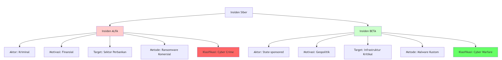
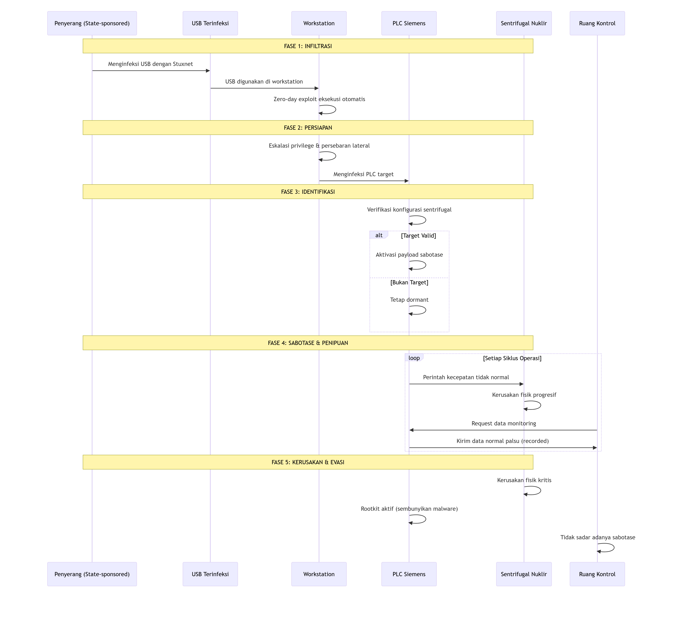
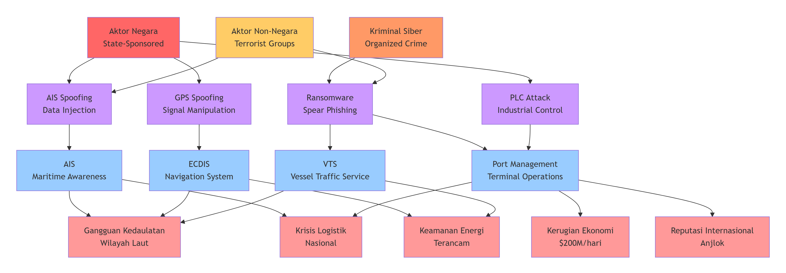

# ⚔️ **ANALISIS CYBER WARFARE**

## 🧩 **BAGIAN A: SOAL LATIHAN PILIHAN GANDA & ESAI SINGKAT**

---

### 🧠 **I. SOAL PILIHAN GANDA**

| No | Pertanyaan | Jawaban |
|----|-------------|----------|
| 1 | Menurut definisi yang disajikan dalam materi, elemen paling fundamental yang membedakan Cyber Warfare dari bentuk serangan siber lainnya adalah... | **b. Aktornya adalah negara-bangsa (atau proksi-nya)** |
| 2 | Pengakuan Cyberspace sebagai domain peperangan kelima berarti bahwa... | **c. Aktivitas di ruang siber dapat dianggap setara dengan aksi militer di domain fisik.** |
| 3 | Serangan yang menargetkan persepsi manusia, seperti kampanye disinformasi dan operasi psikologis (PSYOP), terjadi pada lapisan Cyberspace yang mana? | **c. Cognitive Layer** |
| 4 | Peristiwa historis yang dianggap sebagai titik balik di mana serangan siber pertama kali melumpuhkan infrastruktur digital sebuah negara secara masif adalah... | **c. Serangan Siber terhadap Estonia (2007)** |
| 5 | Tindakan proaktif yang diambil di luar jaringan sendiri untuk memproyeksikan kekuatan dan mencapai tujuan militer, seperti melakukan spionase atau melancarkan serangan, diklasifikasikan sebagai... | **b. Operasi Siber Ofensif (OCO)** |

---

### ✍️ **II. ESAI SINGKAT**

**6. Dua karakteristik unik cyberspace dan dampaknya terhadap konflik modern**

> 1. **Batas geografis kabur** → Serangan dapat diluncurkan dari mana saja ke mana saja.  
> 2. **Anonimitas tinggi** → Sulit mengidentifikasi pelaku.  
> 
> Kedua hal ini membuat eskalasi konflik lebih cepat dan mengaburkan batas antara masa damai dan perang.

---

**7. Perbedaan fundamental Cyber Warfare dan Cyber Crime**

| Aspek | Cyber Warfare | Cyber Crime |
|--------|----------------|-------------|
| **Motivasi** | Geopolitik / Militer | Finansial / Pribadi |
| **Contoh** | Serangan **Stuxnet** ke program nuklir Iran | **WannaCry** ransomware untuk tebusan uang |

---

**8. Mengapa Morris Worm (1988) penting?**

> Morris Worm menjadi contoh pertama penyebaran malware masif yang melumpuhkan jaringan internet awal.  
> Ini membuktikan kelemahan mendasar sistem terhubung dan mendorong lahirnya bidang **keamanan siber modern**.

---

**9. Mission Assurance dalam DCO**

> **Mission Assurance** adalah upaya menjamin misi tetap berjalan meskipun terjadi serangan siber.  
> Dalam **Defensive Cyber Operations (DCO)**, fokusnya bukan hanya melindungi jaringan, tetapi memastikan **fungsi operasional vital tetap berlanjut**.

---

**10. Mengapa Stuxnet disebut “melintasi Rubicon”?**

> Karena Stuxnet adalah senjata siber pertama yang **menyebabkan kerusakan fisik nyata** pada infrastruktur nuklir Iran,  
> membuktikan bahwa **serangan digital dapat berdampak fisik seperti perang konvensional**.

---

## 🧭 **BAGIAN B: TUGAS ANALISIS DAN STUDI KASUS**

---

### ⚖️ **TUGAS 1: ANALISIS KOMPARATIF – CYBER WARFARE vs. CYBER CRIME**

#### 🧩 Deskripsi Insiden

| Insiden | Deskripsi |
|----------|------------|
| **ALFA** | Kelompok kriminal meretas sistem perbankan nasional dan mencuri dana miliaran rupiah menggunakan ransomware dari pasar gelap (Eropa Timur). |
| **BETA** | Fasilitas pengolahan air mengalami malfungsi akibat malware canggih yang menargetkan PLC spesifik, terjadi saat ketegangan diplomatik antar negara. |

---

#### 🔍 Analisis Komparatif

| **Kriteria** | **Insiden ALFA** | **Insiden BETA** |
|--------------|------------------|------------------|
| **Aktor** | Kelompok kriminal (Eropa Timur) | Negara-bangsa (state-sponsored) |
| **Motivasi** | Keuntungan finansial | Tujuan geopolitik / strategis |
| **Target** | Sektor finansial | Infrastruktur kritis nasional |
| **Metodologi** | Ransomware komersial | Malware kustom canggih |
| **Tujuan Akhir** | Pencurian dana | Destabilisasi operasional negara |

---

#### 🧾 Klasifikasi & Justifikasi

- **Insiden ALFA → Cyber Crime**
  - Motif ekonomi, tools umum, target finansial, tanpa konteks politik.
- **Insiden BETA → Cyber Warfare**
  - Target strategis, malware kustom, tanpa tebusan, dalam konteks geopolitik.

---

#### 🖼️ Diagram Visualisasi

  

> **Kesimpulan:**  
> ALFA mencerminkan kriminalitas siber bermotif ekonomi,  
> sedangkan BETA menunjukkan operasi perang siber yang melibatkan negara dan memiliki tujuan strategis nasional.

---

### ☣️ **TUGAS 2: STUDI KASUS MENDALAM – ANATOMI SERANGAN STUXNET**

#### ⚙️ Fase Utama Serangan

1. **Infiltrasi Awal & Menjembatani Air Gap**
   - Penyebaran lewat USB.
   - Eksploitasi *zero-day* Windows.
   - Menyerang sistem offline (air-gapped).

2. **Eskalasi & Persebaran Lateral**
   - Privilege escalation.
   - Pencurian kredensial.
   - Pencarian sistem SCADA/PLC.

3. **Identifikasi & Verifikasi Target**
   - Menargetkan PLC Siemens S7-300/400.
   - Verifikasi sistem kontrol sentrifugal nuklir IR-1.

4. **Sabotase Fisik & Penipuan**
   - Manipulasi kecepatan sentrifugal → kerusakan fisik.  
   - *Fake telemetry* dikirim ke operator agar kerusakan tak terdeteksi.

5. **Pemeliharaan Akses & Evasi**
   - Rootkit untuk sembunyi.  
   - Tetap aktif tanpa terdeteksi.

---

#### ⚔️ Mekanisme Kunci Efektivitas

| Mekanisme | Penjelasan |
|------------|-------------|
| **Sabotase Fisik** | Manipulasi kecepatan sentrifugal menyebabkan kerusakan nyata. |
| **Penipuan Monitoring** | Replay data normal agar operator tak melihat kerusakan. |

---

#### 🧬 Diagram Alur Serangan Stuxnet

  

**Kunci Keberhasilan Stuxnet:**
1. Multi-stage infiltration
2. Target specificity tinggi  
3. Sabotase + penipuan sistem monitoring  
4. Persistence & stealth jangka panjang

---

### ⚓ **TUGAS 3: DAMPAK CYBER WARFARE PADA PERTAHANAN MARITIM INDONESIA**

#### 🛰️ Sistem/Aset Digital Kritis & Rentan

| Sistem | Fungsi | Kerentanan | Kritisitas |
|---------|---------|-------------|-------------|
| **AIS** | Pelacakan & identifikasi kapal | Data tidak terenkripsi | 🔴 Tinggi |
| **ECDIS** | Navigasi & pemetaan digital | Manipulasi chart & GPS | 🔴 Vital |
| **Port Management System** | Operasional pelabuhan & logistik | Terhubung ke jaringan administrasi | 🔴 Strategis |

---

#### ⚠️ Skenario Serangan Siber

1. **AIS Spoofing Attack**
   - **Vektor:** Transmitter AIS palsu  
   - **Dampak:** Kapal tersesat/tabrakan, gangguan logistik nasional.

2. **ECDIS/GPS Spoofing**
   - **Vektor:** Manipulasi sinyal GPS & chart data  
   - **Dampak:** KRI salah arah, ancaman terhadap kedaulatan maritim.

3. **Port System Ransomware**
   - **Vektor:** Spear-phishing ke admin TOS  
   - **Dampak:** Pelabuhan utama lumpuh, kerugian ekonomi besar.

---

#### 🌊 Diagram Pemetaan Ancaman Siber Maritim

  

---

#### 📈 Analisis Dampak Strategis

1. Krisis kedaulatan maritim  
2. Gangguan rantai pasok nasional  
3. Krisis energi akibat pelabuhan lumpuh  
4. Penurunan kredibilitas Indonesia sebagai *poros maritim dunia*

---

#### 🛡️ Rekomendasi Strategis

1. Implementasi **framework keamanan siber maritim nasional**  
2. Enkripsi & autentikasi data AIS/ECDIS  
3. **Air-gapping** sistem pelabuhan kritis  
4. Latihan gabungan **TNI AL × Badan Siber Nasional**

---

### 🧾 **Disusun oleh:**
**KLK LPU HARIS PAMBUDI**  
_STTAL – Program Pertahanan Siber_

---
